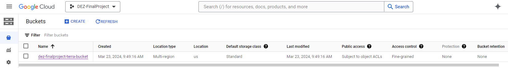
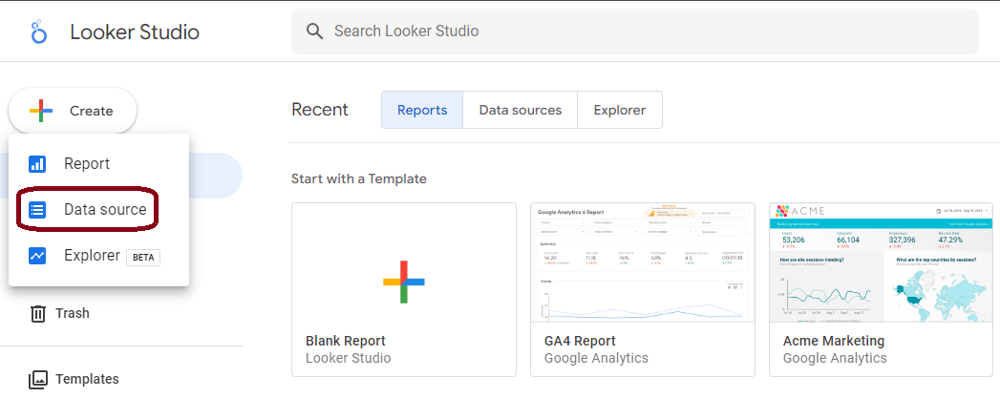
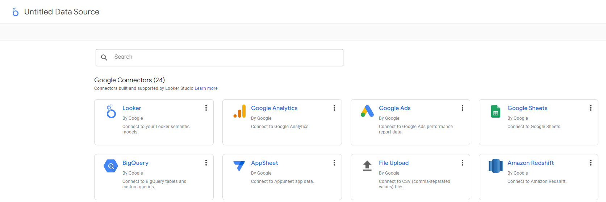
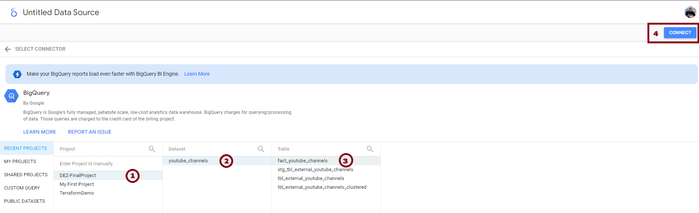
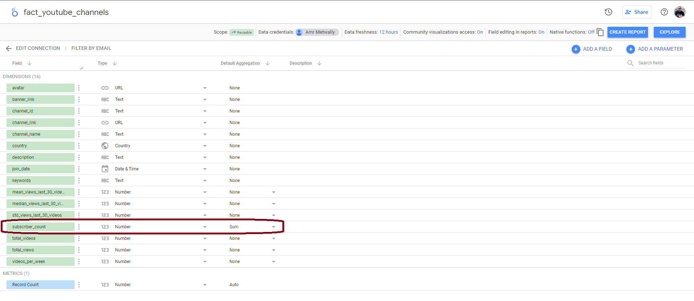
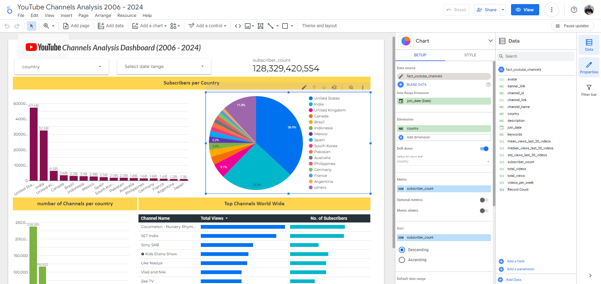

#  Setup project

   

Create new project in <a href = "https://console.cloud.google.com/"> Google Cloud Console </a>

# Setup VM
Create instance with the following specifications:

- region: closest to you with low co2
- Machine Type: e2-standard-4 (4 vCPU, 16 GB Memory)
- Change boot disk: Ubuntu 20.04 LTS, Size: 30 GB (my Recommendation that size not less than60GB)
- you might have to enable the compute engine API if you haven't created a VM on this account before

# Setup SSH to VM
- in your local terminal:

      ssh-keygen -t rsa -f ~/.ssh/<DESIREDNAMEOFYOURKEY> -C <DESIREDUSERNAMEONVM> -b 2048

- cat out the public key:

      cat .ssh/<DESIREDNAMEOFYOURKEY>.pub
- copy output, go to VM instance on Google Cloud Console & paste ssh key under Metadata
- Go back to the VM and start it, copy the external IP
- Create a config-file locally under your .ssh directory with the following content:
  
      Host <hostname to use when connecting>
      HostName <external IP>
      User <DESIREDUSERNAMEONVM you specified in ssh-keygen command>
      IdentityFile <path to your private key> e.g.  ~/.ssh/privatekey
  
- go to your local terminal and type
  
      ssh <hostname to use when connecting>
## Congrats! You're now connected to your VM 🤩

# Connecting and setting up VSCode
- install VS Code locally if you don't have it already
- search Extensions for SSH and install Remote-SSH from Microsoft
- install Python extension if you need to
- in the lower left hand corner click the green icon to Open a Remote Window
- choose "Connect to Host..." and either choose your ssh connection or type in the name your chose for Host in your config

# Create Service Account
- go to IAM & Admin → Service Accounts on Google Cloud Console
- create service account
- grant the following roles:
  - Viewer
  - Storage Admin
  - Storage Object Admin
  - BigQuery Admin
- click continue and navigate to the three dots on the right side and click on manage keys
- choose: Add Key ➡️ Create new key ➡️ JSON ➡️ Create
- key will be downloaded onto local computer

#  Setup Terraform (IaC)    
## install terraform 
   - Open a new terminal then run the below commands to get terraform:
     
          wget -O- https://apt.releases.hashicorp.com/gpg | sudo gpg --dearmor -o /usr/share/keyrings/hashicorp-archive-keyring.gpg
     
          echo "deb [signed-by=/usr/share/keyrings/hashicorp-archive-keyring.gpg] https://apt.releases.hashicorp.com $(lsb_release -cs) main" | sudo tee /etc/apt/sources.list.d/hashicorp.list
     
  - after previous step completed run the below command
  
        sudo apt update && sudo apt install terraform
    
  - after installation complete, check create a new directory terraform and run the below command to download the required terraform packages. 
  
        terraform init   

## Setup your project infrastructure
- Create main.tf & variables.tf files to build the infrastructure
  - <a href = "/terraform/main.tf"> main.tf </a>
  - <a href = "/terraform/variables.tf"> variables.tf </a>
  - after the files are created successfully, run the below commands:

        terraform plan
        terraform apply

## Congrats! your infrastructure are built successfully 🙏
 

#   Mage Orchistration  

 👉 The instructions are available <a href = "mage/ReadMe.md"> here </a>

#   dbt   
 👉 The instructions are available <a href = "dbt_transformation/youtube_channels/README.md"> here </a>

#   Google Looker Studio    
Go to <a href = "https://lookerstudio.google.com/navigation/reporting"> Looker Studio </a> create an account if you don't have it already

- Create a Data Source
  
  
  
- Choose `Big Query` as a google connector
  
  

- Choose `Dataset`
  
  

- Define `Aggregation`
  
  

- Customize your Dashboard
  
   

    # `Congrats you build your own project`
