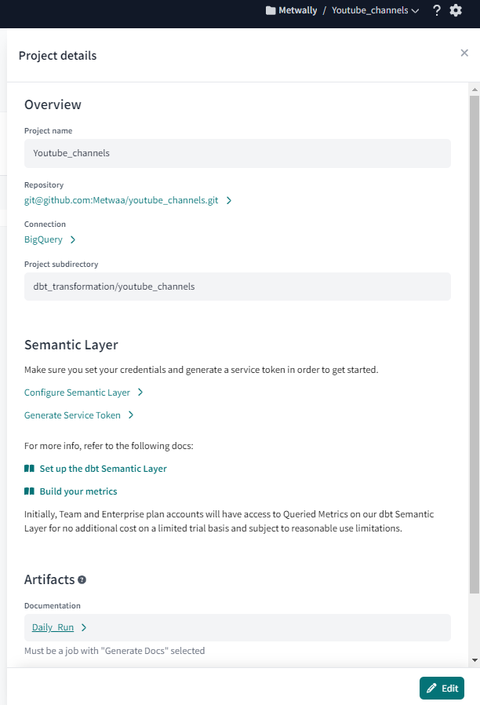
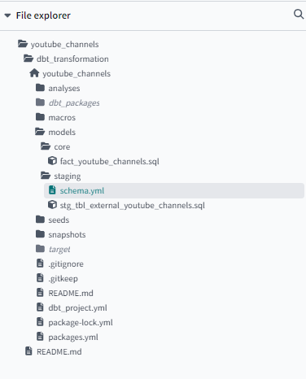
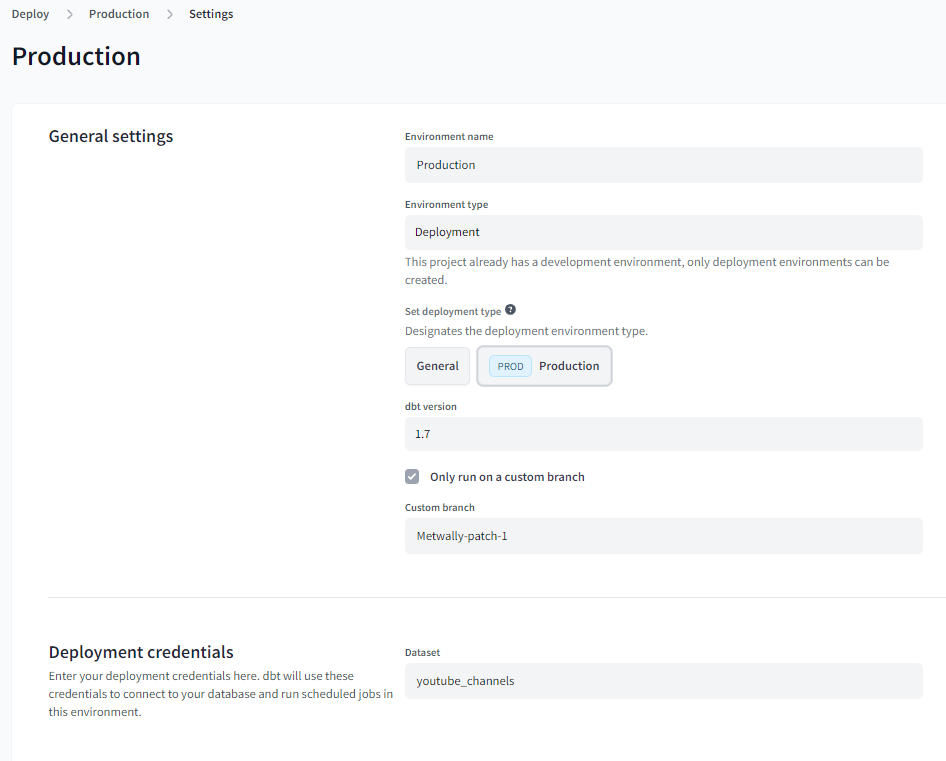
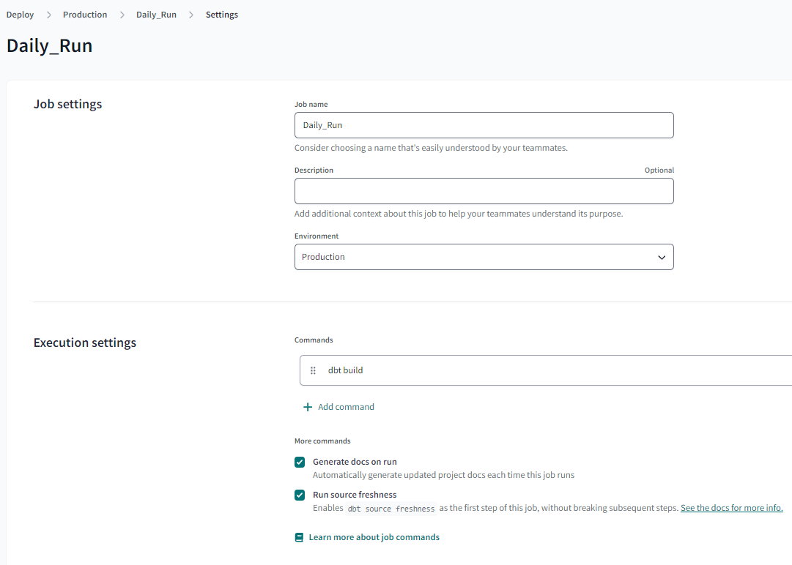
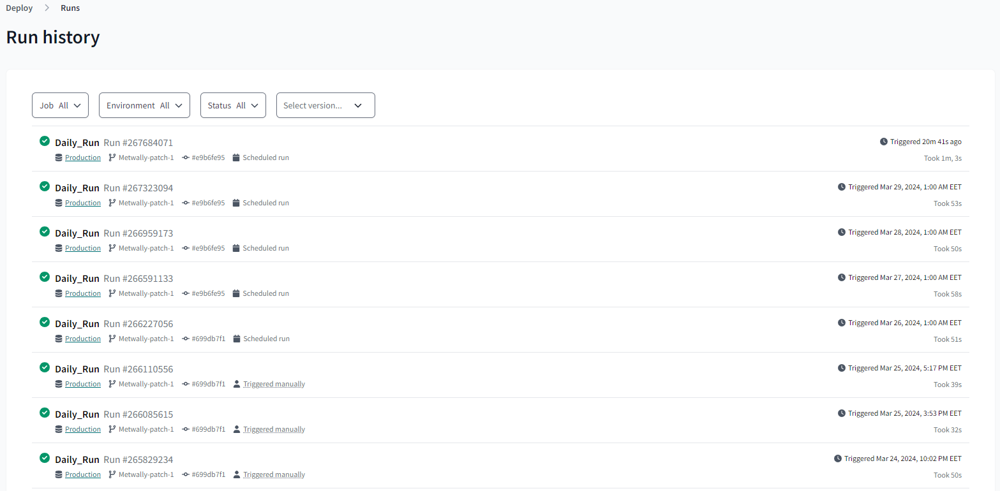

# Welcome to your new dbt project!
1. Firstly you need to create an account if you don't have it already
    - <a href ="https://www.getdbt.com/signup"> dbt cloud account </a>
2. create a new project and connect it to your warehouse
    - check this guidance <a href = "https://github.com/DataTalksClub/data-engineering-zoomcamp/blob/main/04-analytics-engineering/dbt_cloud_setup.md"> Click Here </a>
    - dbt documentations <a href = "https://docs.getdbt.com/docs/cloud/git/connect-github" > Click Here </a>
    
3. after project creation you should see the project details window:
   
   
   
4. navigate to Develop ➡️ Cloud IDE then run `dbt deps` in the console, so your environment is ready

5. create your `models` in `staging` & `Core`

      

6. the project lineage

      
   
# Run dbt in production
1. Go to environments in dbt cloud and create environment
   
       

2. Go to jobs in dbt cloud and create new job with schedule `(Hourly, Daily)`
  
     

3. Check the job Run history
     

Back to 🔙 <a href="../../Reproduce.md">  Reproduce </a>

### Resources:
- Learn more about dbt [in the docs](https://docs.getdbt.com/docs/introduction)
- Check out [Discourse](https://discourse.getdbt.com/) for commonly asked questions and answers
- Join the [dbt community](https://getdbt.com/community) to learn from other analytics engineers
- Find [dbt events](https://events.getdbt.com) near you
- Check out [the blog](https://blog.getdbt.com/) for the latest news on dbt's development and best practices
