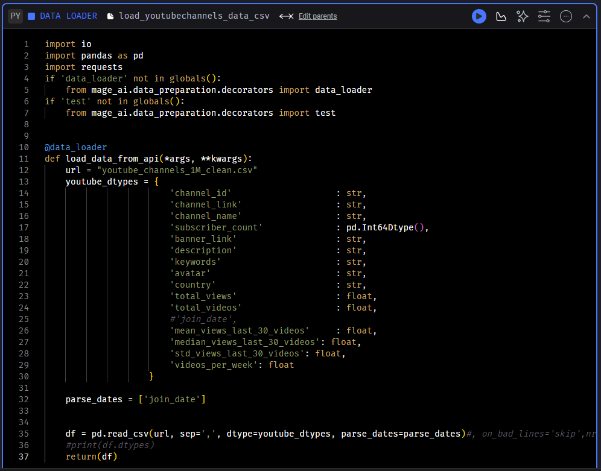
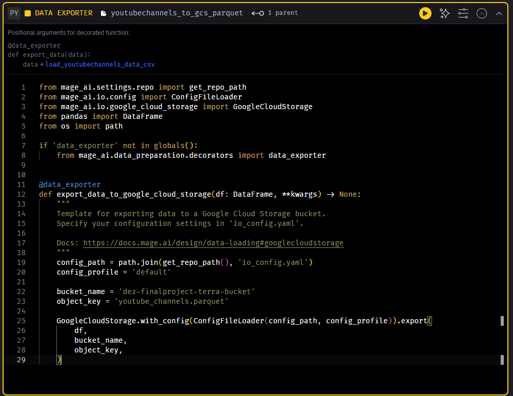
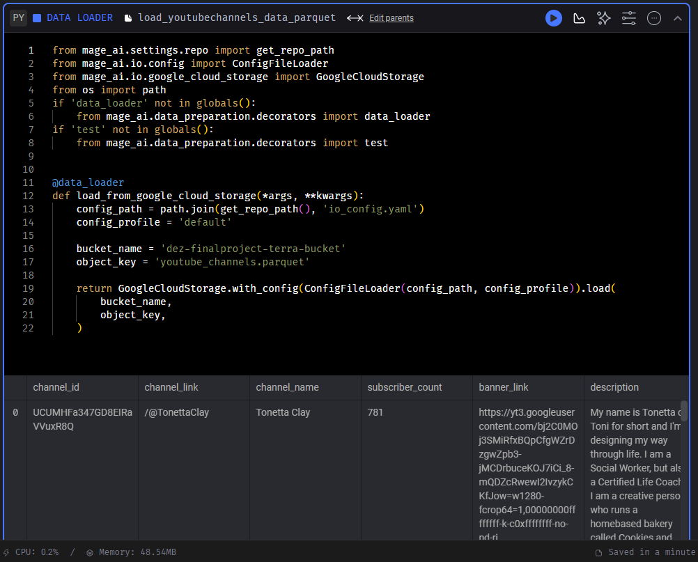
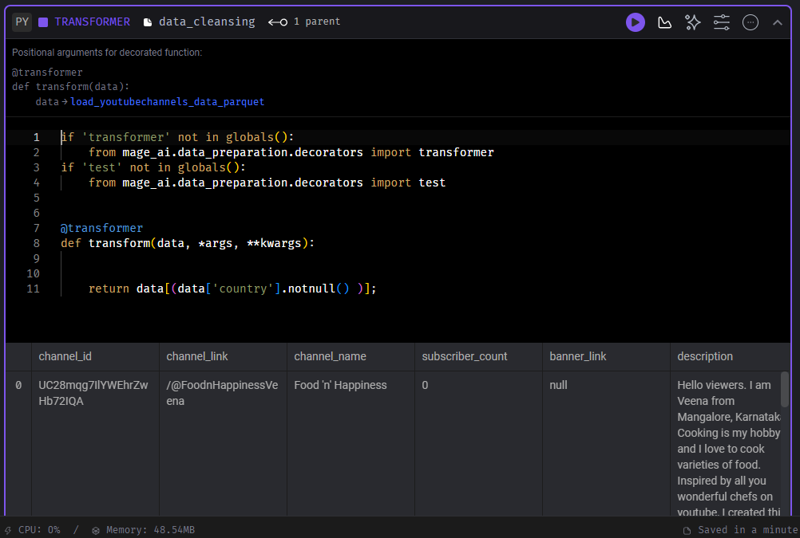
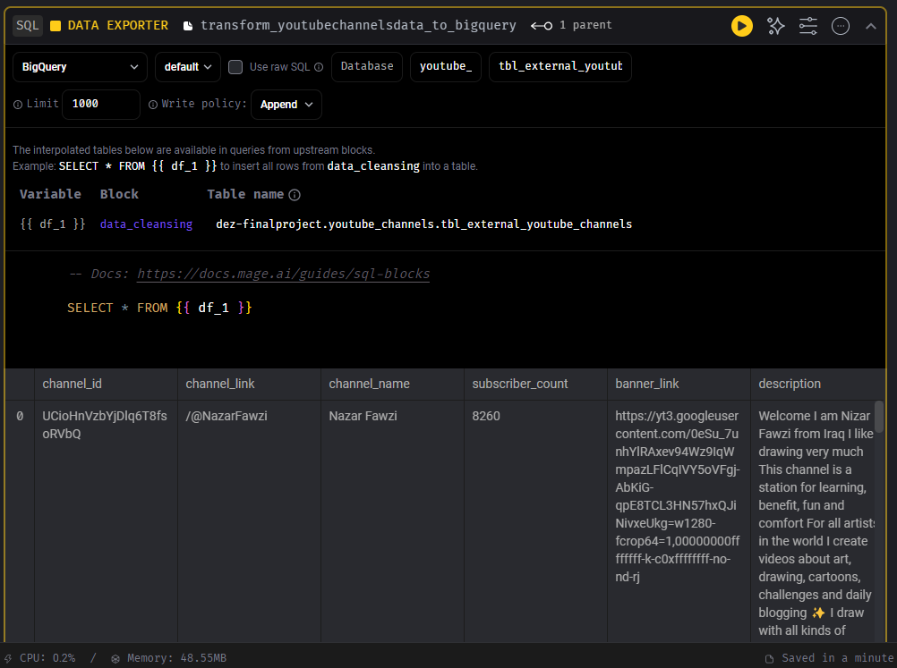
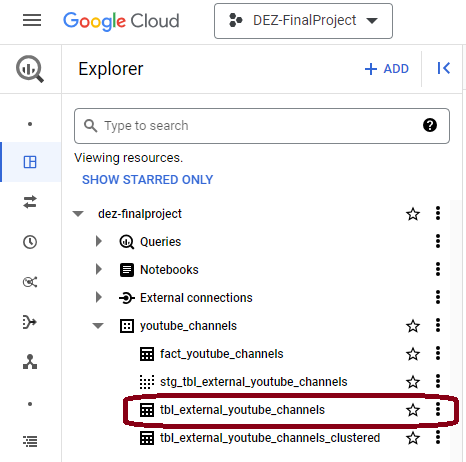

# Mage Orchistration installation

You can start by cloning the repo:

    git clone https://github.com/mage-ai/mage-zoomcamp.git mage-zoomcamp

Navigate to the repo:

    cd mage-data-engineering-zoomcamp

Rename `dev.env` to simply `.env` - this will ensure the file is not committed to Git by accident, since it will contain credentials in the future.

Now, let's build the container

    docker compose build

Finally, start the Docker container:

    docker compose up

Now, navigate to http://localhost:6789 in your browser! You're ready to get started with the Mage.

# Start Create your pipelines
  ## First Pipeline: GCS (Data Lake)
  - ### Data Loader to read CSV file 
     
  - ### Data Expoter to GCS
     

### CSV data Transferred into a Data Lake
   

  ## Second Pipeline: Big Query (DWH)
  
  - ### Data Loader from GCS
    
  
  - ### Transformer to remove `null` values
    
  
  - ### Data Expoter to Big Query
    

### Big Query table created successfully
   

Continue to <a href=""> dbt Platform </a>

Back to 🔙 <a href="../Reproduce.md">  Reproduce </a>

